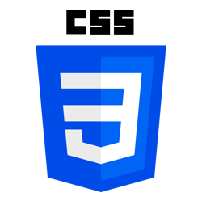
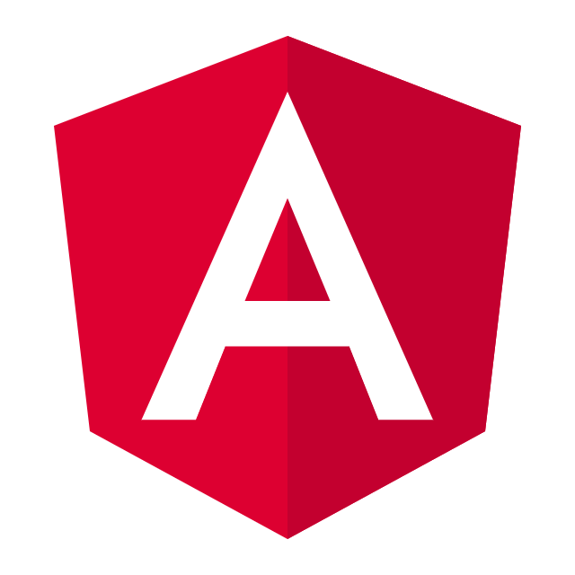
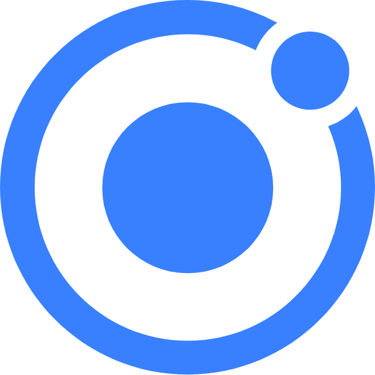

<h1 align="center">Hi there! 👋 I'm Lakindu Virajith</h1>
<h3 align="center">A Software Development Enthusiast and Full Stack Developer. Always on the lookout for new technologies to learn and implement. Let's build something amazing together! 🚀</h3>

---
 

    
    &nbsp;&nbsp;
    
    &nbsp;&nbsp;
    
    &nbsp;&nbsp;
    
    &nbsp;&nbsp;
    
    &nbsp;&nbsp;
    

---

-  🚀 I’m currently learning **Spring Boot**

-  🎓 I’m currently learning BSc (Hons) in Information Technology Specializing in Software Engineering Degree

-  ✉️ How to reach me **lakinduvirajith@gmail.com**

### Connect with Me on

  <!--facebook icon-->
  &nbsp;&nbsp;
  <!--instagram icon-->
  &nbsp;&nbsp;
  <!--twitter icon-->
  &nbsp;&nbsp;
  <!--linkedin icon-->
  

### Languages and Tools

  <!--html icon-->
  &nbsp;&nbsp;
  <!--css icon-->
  &nbsp;&nbsp;
  <!--scss icon-->
  &nbsp;&nbsp;
  <!--tailwind icon-->
  &nbsp;&nbsp;
  <!--bootstrap icon-->
  &nbsp;&nbsp;
  <!--js icon-->
  &nbsp;&nbsp;
  <!--typescript icon-->
  

 

  <!--react icon-->
  &nbsp;&nbsp;
  <!--nextjs icon-->
  &nbsp;&nbsp;
  <!--angular icon-->
  &nbsp;&nbsp;
  <!--ionic icon-->
  

 

  <!--node js icon-->
  &nbsp;&nbsp;
  <!--express icon-->
  &nbsp;&nbsp;
  <!--spring boot icon-->
  &nbsp;&nbsp;
  <!--mongo db icon-->
  &nbsp;&nbsp;
  <!--mysql icon-->
  &nbsp;&nbsp;
  <!--firebase icon-->
  

 

  <!--python icon-->
  &nbsp;&nbsp;
  <!--c icon-->
  &nbsp;&nbsp;
  <!--c++ icon-->
  &nbsp;&nbsp;
  <!--java icon-->
  &nbsp;&nbsp;
  <!--php icon-->
  &nbsp;&nbsp;

 

  <!--android icon-->
  &nbsp;&nbsp;
  <!--intellij idea icon-->
  &nbsp;&nbsp;
  <!--vs code icon-->
  &nbsp;&nbsp;
  <!--visual studio icon-->
  &nbsp;&nbsp;
  <!--eclipse ide icon-->
  &nbsp;&nbsp;
  <!--postman icon-->
  

 

  <!--photoshop icon-->
  &nbsp;&nbsp;
  <!--illustrator icon-->
  &nbsp;&nbsp;
  <!--premiere pro icon-->
  &nbsp;&nbsp;
  <!--xd icon-->
  &nbsp;&nbsp;
  <!--figma icon-->
  &nbsp;&nbsp;

 

