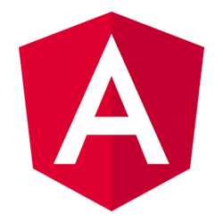
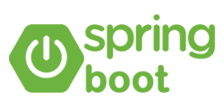
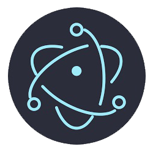
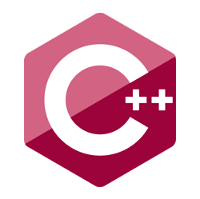
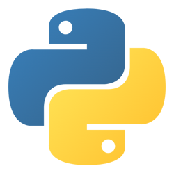
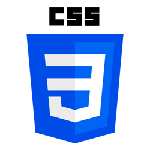
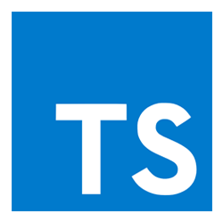
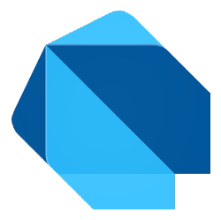
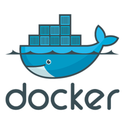

<h1 align="center">Hi there! 👋 I'm Lakindu Virajith</h1>
<h3 align="center">A Software Development Enthusiast and Full Stack Developer. Always on the lookout for new technologies to learn and implement. Let's build something amazing together! 🚀</h3>

---
 

    
    &nbsp;&nbsp;
    
    &nbsp;&nbsp;
    
    &nbsp;&nbsp;
    
    &nbsp;&nbsp;
    
    &nbsp;&nbsp;
    

---

-  🚀 I’m currently learning **Flutter**

-  🎓 I’m currently learning BSc (Hons) in Information Technology Specializing in Software Engineering Degree

-  ✉️ How to reach me **lakinduvirajith@gmail.com**

# Connect with me on
&nbsp;&nbsp;
&nbsp;
&nbsp;
&nbsp;

# Languages and Tools
### Frontend
&nbsp;&nbsp;
&nbsp;&nbsp;

### Backend
&nbsp;&nbsp;

### Mobile
&nbsp;&nbsp;

### Desktop

### Languages
&nbsp;
&nbsp;
&nbsp;
&nbsp;&nbsp;

&nbsp;
&nbsp;
&nbsp;
&nbsp;&nbsp;
&nbsp;&nbsp;
&nbsp;&nbsp;

### Database

&nbsp;

### Cloud Platforms
&nbsp;

### IDE
&nbsp;
&nbsp;
&nbsp;
&nbsp;

### UI/UX
&nbsp;
&nbsp;
&nbsp;

### Software Platforms, Environments & Tools
&nbsp;&nbsp;
&nbsp;&nbsp;
&nbsp;&nbsp;
&nbsp;

# More Infomation

